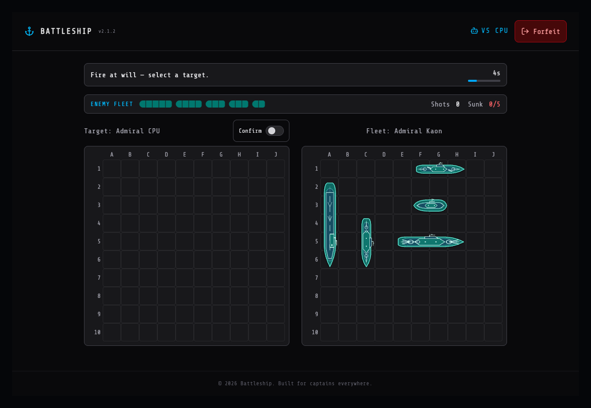

# ⚓ Battleship

A fast, responsive fleet action against a friend or a computer captain.

Sound general quarters, deploy your fleet in secret, and trade fire across enemy waters. Find and sink every opposing ship before your own fleet is sent to the bottom.

**[Play Battleship](https://battleship.yahaha.net)** · Current release `v2.1.2`



## Start a battle

1. Choose your callsign. It is saved automatically on your device.
2. Choose **Computer** for an instant solo battle, or **Online** to challenge another player.
3. For an online battle, send your friend the invite link or six-character room code.
4. Deploy your fleet from the tactical control panel and open fire.

No account or installation is required. The command deck adapts to desktop, tablet, and phone screens.

## How to win

Each captain secretly places five ships across a 10 × 10 ocean grid. During battle, take turns choosing a coordinate in enemy waters:

- **Miss** — the shot lands in open water.
- **Hit** — the shot strikes part of a ship.
- **Sunk** — every section of that ship has been hit.

The first captain to sink all five enemy ships wins.

## Your fleet

| Ship | Size |
| --- | ---: |
| Carrier | 5 cells |
| Battleship | 4 cells |
| Cruiser | 3 cells |
| Destroyer | 3 cells |
| Submarine | 2 cells |

Ships can be placed horizontally or vertically, but they cannot overlap or extend beyond the grid. Each class has its own detailed overhead silhouette, so your fleet stays readable at a glance. Use **Random** when you want to deploy a full fleet instantly.

## Battle pace

- You have 90 seconds to deploy. Any unfinished fleet is placed automatically when time runs out.
- Each turn lasts 12 seconds. If time expires, the game fires at an untouched coordinate for you.
- Shots fire immediately by default to keep battles moving quickly. Your chosen sector stays locked while the shot report arrives.
- Prefer extra protection against misclicks? Turn on shot confirmation above the enemy grid, then click the same coordinate again to confirm.
- If your connection drops briefly, the game will try to return you to the same battle.

After the battle, both captains can vote for an immediate rematch. Your win and loss record stays in your current browser.

In a computer battle, Admiral CPU searches the ocean and follows up around a successful hit. A rematch starts as soon as you request one.

## Signals from the bridge

The bridge crew keeps reports short when the guns open:

- **General quarters** — all hands prepare for battle.
- **Fire at will** — choose any untouched sector and open fire.
- **Direct hit** — your shot struck an enemy ship.
- **Shot fell wide** — open water; adjust your aim.
- **Target locked** — with shot confirmation enabled, choose the same sector again to fire.
- **Sent to the bottom** — the enemy fleet has been destroyed.

## Captain's tips

- Avoid placing every large ship in the same area.
- After a hit, check adjacent coordinates to discover which way the ship extends.
- On a phone, swipe sideways through the fleet list during deployment.
- Private battles do not appear in the open lobby. Join them with a room code or invite link.

## Play locally

To run a battle on your own computer:

```bash
pnpm install
pnpm dev
```

Open [http://localhost:3000](http://localhost:3000), then fight the computer or invite another captain.
